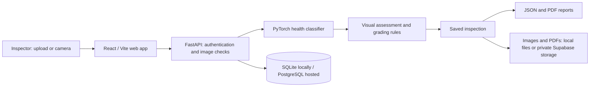

# Visionion

**Onion visual-health screening with traceable inspection reports.**

Visionion is a computer-vision research prototype that helps an inspector capture onion photographs, review visible-health predictions, and keep the evidence behind each decision. It combines a React web app, a FastAPI backend, a trained PyTorch classifier, and downloadable PDF reports. Older module names, database names, and documentation refer to the project as **OnionGrade AI**.

The project supports an inspection workflow from image capture to saved results. It is intended to assist human review; it does not certify food safety, official procurement grades, or the quality of an entire lot from one photograph.

## What you can do

- Upload a photo or capture one with a camera in the responsive web interface.
- Screen a whole photograph, or draw individual bulb outlines for separate region predictions.
- Review **healthy bulb**, **unhealthy bulb**, and **leaf only** predictions with confidence and uncertainty reasons.
- Receive app-defined visual assessments: **Good**, **Poor**, or **Review required**. A healthy prediction above 90% confidence with no uncertainty warnings receives the custom, unofficial **A** label.
- Optionally estimate bulb diameter using a valid individual outline and a known-size reference in the same plane.
- Screen batches of 1–10 photographs independently.
- Sign in, revisit saved inspections, export JSON, and generate PDFs containing original and annotated evidence with hash/QR verification.
- Select an explicit **demo analysis** mode to explore mock segmentation and grading findings when enabled.

**Custom A is not official Grade A.** Model confidence is not measured accuracy. The specification-based Grade A/URS layer is separate, and missing evidence remains unresolved. Demo findings are synthetic and are not predictions about the uploaded photograph.

## How an inspection works

1. Create an account, verify the six-digit code delivered to your email inbox, and sign in. Email delivery must be configured on the API host.
2. Select **Trained onion health model** and upload or capture a clear image. **Whole photo · no drawing** is the default; it produces one image-level assessment, including for group photographs.
3. For separate bulb results, select **Individual onions · optional**, outline each visible bulb, and finish each outline. These regions come from the user, not automatic detection.
4. If physical size is needed, add a printed 50 mm marker or select two endpoints of a reference with a known length in millimetres. A valid bulb outline is also required.
5. Analyze the image and review the health label, visual assessment, confidence, and unresolved findings.
6. Save the inspection, export its JSON, or generate and verify a PDF report.

A group photograph does not establish bulb counts or the percentage healthy. Images of a single clearly visible onion are easier to interpret; uncertain or incomplete evidence needs human review.

## Architecture



| Component | Implementation and responsibility |
| --- | --- |
| Web client | React 19, TypeScript, Vite; capture, outlines, calibration, result review, and history |
| API | Python 3.12, FastAPI, Pydantic; authenticated inspection and report endpoints |
| Computer vision | PyTorch / TorchVision MobileNetV3 Small; three-class visual-health inference; OpenCV image/calibration utilities |
| Grading | Separate visual-health policy and configuration-driven specification rules in `backend/grading/` and `config/` |
| Database | SQLAlchemy and Alembic; local SQLite prototype or PostgreSQL |
| Evidence and reports | JPEG evidence, ReportLab PDFs, SHA-256 hashes, QR verification; optional private Supabase object storage |
| Deployment | Docker Compose, Vercel frontend configuration, and Render deployment blueprint |

The backend checks the selected checkpoint against its metadata hash. Inspection snapshots record model/specification information. Reports carry a canonical analysis hash; PDF bytes have a separate stored hash. These checks support integrity verification, but they are not digital signatures or an externally anchored audit ledger.

## Model status and limitations

The loader in [`backend/inference.py`](backend/inference.py) prefers **`bulb-health-v3`** when both its checkpoint and metadata exist, then falls back to **`bulb-health-all-v2`**, then **v1**. Check `GET /api/model/info` to identify the model actually loaded by a deployment.

| Checkpoint | Dataset and evaluation scope |
| --- | --- |
| v3, preferred in the current source | 24,000 source photographs: 16,542 training, 3,803 validation, 3,655 test. Recorded internal test accuracy: **98.11%**, macro F1: **0.9782**. |
| v2, fallback | Trained on all **16,271 unique usable images** from the earlier dataset. **No independent holdout remains; no validated v2 accuracy is claimed.** |
| v1, earlier baseline | Historical evaluation and split limitations are documented in the model card; its metrics do not establish v2 or v3 performance. |

The v3 split separates source hashes and filename proxy groups. Repeated subjects, class-associated backgrounds, and unverified near-duplicate/session independence mean its internal results are **not validated farm-level performance**. Its group-photo evaluation is a subset of the test set, not another independent dataset. See [v3 training and evaluation notes](docs/new-dataset-training-2026-10-01.md) and [checkpoint metadata](ml/models/bulb-health-v3.json).

The supplied datasets do not provide instance boxes/masks, defect-subtype annotations, measured diameters, or official grading labels. Consequently:

- Automatic bulb detection and segmentation are not supplied as trained capabilities. Optional YOLO scaffolding requires compatible, separately trained and validated weights.
- An unhealthy prediction does not identify rot, damage, sprouting, or another specific defect.
- A healthy prediction does not establish official Grade A/URS eligibility, absence of hidden defects, or food safety.
- Physical size accuracy has not been independently validated.
- Leaf-only is not a general detector of unrelated objects; unfamiliar objects can be misclassified.
- PWA shell caching does not provide offline inference or automatic synchronization. Native mobile inference remains future work.

[Authoritative project constraints](docs/project-constraints.md) govern claims and deployment acceptance. Their v2-specific statements describe the earlier checkpoint; the newer v3 source and training notes above document the current loader behavior without removing those evidence limits. The [model card](ml/MODEL_CARD.md) covers v1/v2 history.

## Run locally

Use **Python 3.12** and **Node.js 22+**. From the repository root in PowerShell:

```powershell
python -m venv .venv
.\.venv\Scripts\python.exe -m pip install -r backend/requirements.txt
.\.venv\Scripts\python.exe -m pip install torch==2.6.0 torchvision==0.21.0 --index-url https://download.pytorch.org/whl/cpu
npm.cmd ci --prefix web
```

The command above installs CPU inference dependencies. The existing CUDA training environment uses PyTorch 2.6.0 / TorchVision 0.21.0 with CUDA 12.4. Keep the selected checkpoint and its matching JSON metadata in `ml/models/`.

Start the API:

```powershell
.\.venv\Scripts\python.exe scripts/run_local.py
```

In a second terminal, start the web app:

```powershell
npm.cmd run dev
```

Open the app at **http://127.0.0.1:5173** and the API's interactive documentation at **http://127.0.0.1:8000/docs**. Vite proxies local `/api` requests to port 8000. On macOS/Linux, use `.venv/bin/python` and `npm` for the corresponding commands.

The launcher creates a persistent local JWT secret and uses `data/oniongrade.db` for SQLite development unless PostgreSQL is configured. Set `DATABASE_URL` or the `POSTGRES_HOST`, `POSTGRES_PORT`, `POSTGRES_USER`, `POSTGRES_PASSWORD`, and `POSTGRES_DB` variables to use PostgreSQL. The launcher applies migrations and performs the existing SQLite migration with hash checks. Keep `data/` private.

### Email and environment configuration

Use [`.env.example`](.env.example) as a configuration reference. For the local launcher, set variables in its terminal; it does not automatically load `.env`.

For SMTP delivery, configure your sender and provide its app password privately before starting the API:

```powershell
$env:SMTP_USERNAME = 'your-sender@gmail.com'
$env:SMTP_FROM = $env:SMTP_USERNAME
$smtpSecret = Read-Host 'Sender app password' -AsSecureString
$env:SMTP_APP_PASSWORD = [System.Net.NetworkCredential]::new('', $smtpSecret).Password
.\.venv\Scripts\python.exe scripts/run_local.py
```

The Windows launcher also accepts the Git-ignored `data/smtp-app-password.txt` when that environment variable is absent. Hosted backends should use private environment settings. Credentials belong on the backend and must never be committed or placed in `VITE_` variables. For the hosted Gmail HTTPS flow, see [email deployment configuration](docs/gmail-api-deployment.md).

## API overview

| Route | Purpose |
| --- | --- |
| `POST /api/auth/register`, `/api/auth/verify-otp`, `/api/auth/resend-otp`, `/api/auth/login` | Account creation, email verification, and sign-in |
| `GET /api/auth/me` | Current account |
| `POST /api/analyze` | Multipart image analysis with mode, optional region polygons, calibration points/reference length, and variety |
| `POST /api/analyze/batch` | 1–10 independent whole-image health screens |
| `GET /api/inspections`, `/api/inspection/{id}` | Saved history and inspection details |
| `GET /api/inspection/{id}/image`, `/api/inspection/{id}/annotated` | Original and annotated evidence |
| `POST /api/report/{id}`, `GET /api/report/{id}/pdf` | Generate and download a report |
| `GET /api/reports/verify/{token}` | Public report verification |
| `GET /api/model/info`, `/api/grading-spec`, `/api/health`, `/api/audit/verify` | Model, rules, service health, and audit checks |
| `GET /api/calibration/config`, `/api/calibration/marker.pdf` | Calibration configuration and printable marker |

Use the running API's OpenAPI documentation for request schemas and authentication requirements. Batch screening does not deduplicate the same onion across photographs.

## Repository guide

```text
web/                 React interface and browser assets
backend/             FastAPI, authentication, database, evidence, and reports
backend/grading/     Visual assessments and specification-based rules
backend/migrations/  Alembic schema migrations
ml/                  Dataset preparation, training, evaluation, and model artifacts
config/              Grading specification, size bands, and URS configuration
docs/                Architecture, validation, constraints, and deployment notes
scripts/             Local startup, migration, inference audits, and browser checks
infra/               Dockerfiles and serving configuration
mobile/              Mobile/PWA scope and deferred native features
samples/             Sample inputs
```

## Training and verification

The raw archives and prepared dataset are separate inputs; reproduce training only after obtaining the corresponding source data. The newer workflow is:

```powershell
.\.venv\Scripts\python.exe ml/datasets/prepare_new_health.py
.\.venv\Scripts\python.exe ml/training/train_new_health.py --epochs 12 --workers 0
```

For the older dataset and v1/v2 workflow:

```powershell
.\.venv\Scripts\python.exe ml/datasets/prepare_dataset.py
.\.venv\Scripts\python.exe ml/datasets/validate_dataset.py
.\.venv\Scripts\python.exe ml/training/train_health.py --epochs 12 --workers 2
.\.venv\Scripts\python.exe ml/training/export_health.py
.\.venv\Scripts\python.exe ml/training/train_all_health.py
```

Run application checks from the repository root:

```powershell
.\.venv\Scripts\python.exe -m pytest backend/tests backend/grading/tests -q
npm.cmd run build
.\.venv\Scripts\python.exe scripts/verify_real_model.py
```

Browser checks are available under `scripts/browser-*.cjs`; they require Playwright and the configured browser. The v1 TorchScript artifact is an earlier export, not a v3 mobile runtime.

## Deployment

A complete deployment needs a frontend, an HTTPS API capable of running PyTorch, PostgreSQL, persistent image/PDF storage, and email verification. Camera access requires HTTPS or localhost.

- **Vercel frontend:** deploy `web/`, set `VITE_API_BASE_URL` to the API origin without `/api` or a trailing slash, and allow the frontend origin in backend `CORS_ORIGINS`. See [Vercel deployment](docs/vercel-deployment.md).
- **Render / Supabase:** `render.yaml` provides a starting blueprint. The [recorded deployment status](docs/render-supabase-status.md) describes checks from October 1, 2026 and outstanding email/storage acceptance; it is not a current availability guarantee. Verify private storage persistence across restarts before relying on hosted evidence.
- **Docker Compose:** copy `.env.example` to `.env`, replace `JWT_SECRET` and `POSTGRES_PASSWORD`, and add `DEMO_PASSWORD` as required by `compose.yaml`. Run `docker compose up --build` and open `http://localhost:8080`. Configure email separately for account registration. Compose creates its own database volume; it does not automatically include local history.

Keep one API worker while locks and rate counters remain process-local. Free hosting can sleep or hit quotas. Review [project constraints and deployment acceptance](docs/project-constraints.md) before claiming continuous availability or independence from the local backend.

## Further documentation and next steps

- [Combined architecture and flowcharts](docs/combined-architecture.md)
- [Validation notes](docs/validation.md)
- [Database schema](docs/schema.sql)
- [Dataset sources](ml/DATASET_SOURCES.md)
- [Mobile/PWA scope](mobile/README.md)

Remaining work includes independent capture-session evaluation, expert instance/defect annotations, physical measurement validation, an expert adjudication workflow, official grading specifications, stronger production identity/audit controls, and native offline inference.
