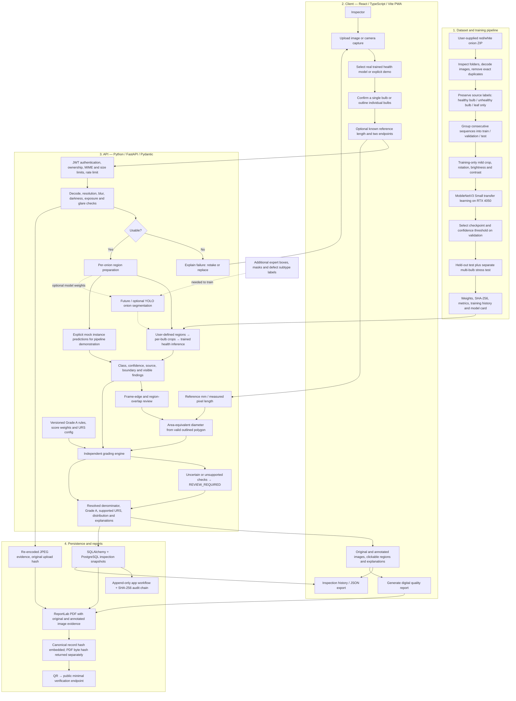
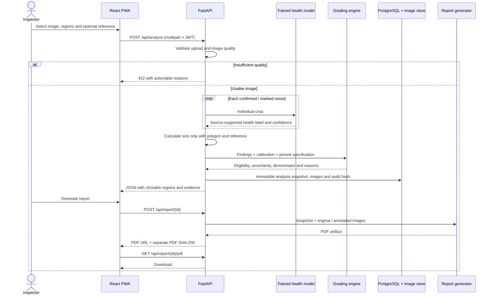

# OnionGrade AI — combined technical architecture

The system has two connected flows: offline model development and online image inspection. Machine learning produces evidence; a separate versioned rule engine decides whether that evidence establishes Grade A eligibility.

## Technology mapping

| Layer | Implementation | Current boundary |
|---|---|---|
| Client | React, TypeScript, Vite; responsive PWA | Browser camera file input; server required for inference |
| API | FastAPI, Pydantic, JWT | One environment-configured inspector account; no production RBAC |
| Quality gate | Pillow + NumPy Laplacian/brightness/glare | These are capture checks, not proof that an object is an onion |
| Real model | PyTorch / TorchVision MobileNetV3 Small | Broad bulb-health labels only; user-supplied individual regions |
| Segmentation | Optional Ultralytics adapter | No trained onion segmentation weights supplied; never use general object classes as onion evidence |
| Measurement | Polygon area + user-marked reference | Same-plane approximation; no invented millimetres without scale |
| Grading | Pure Python module + validated JSON configuration | Demo rules; health-only evidence cannot certify Grade A |
| URS | Separately versioned configuration | Disabled until an authoritative definition is supplied |
| Persistence | SQLAlchemy, PostgreSQL, local JPEGs/PDFs | Local server or Docker Compose PostgreSQL required |
| Reports | ReportLab, QR, SHA-256 | Integrity checks are not government certification or digital signatures |
| Deployment | Docker / Nginx; local Python and Vite | Single API worker; local rate limits and locks are not distributed |

## Request sequence

## Decision policy

1. Missing calibration means no physical diameter. A confirmed whole-image bulb has no segmented boundary, so adding a reference alone still cannot establish its size.
2. Low confidence, unknown defect types, clipped regions and missing required checks keep eligibility unresolved.
3. Grade A percentage uses only resolved decisions. Both numerator/denominator and excluded review count are displayed.
4. The real health model has no validated defect-subtype coverage. Its Grade A and weighted defect quality score remain unavailable even when broad health is predicted confidently.
5. Demo masks and classes are fixed mock geometry, visibly marked in the UI, API and PDF. They do not assess the uploaded image.
6. URS remains null until a sourced configuration is enabled. It is never assumed to equal 100 minus Grade A.
7. Batch images are independent analyses; no claim of cross-image onion deduplication is made.

## Dataset and measured training results

The supplied nested ZIP contains 16,300 JPEGs. Preparation removed 29 exact duplicates, found zero corrupt files and retained 16,271 images. Training uses single-bulb and leaf-only images; multiple-bulb images are a separate stress test.

| Partition | Healthy bulb | Unhealthy bulb | Leaf only | Total |
|---|---:|---:|---:|---:|
| Training | 4,099 | 1,368 | 2,710 | 8,177 |
| Validation | 900 | 297 | 529 | 1,726 |
| Held-out test | 1,000 | 338 | 799 | 2,137 |
| Multi-bulb stress | 2,220 | 2,011 | 0 | 4,231 |

Training stopped after ten epochs under validation early stopping; epoch six was selected. Provisional held-out accuracy is **99.77%**, macro F1 **0.9970**. Multi-bulb image-level stress accuracy is **86.79%**. The latter does not measure individual onions. Model weights occupy approximately **6.21 MB**.

There are no lot/session IDs. Splits use 100-consecutive-filename groups, targeting 70/15/15 by group; variable group sizes mean actual image proportions differ. No exact hash or proxy group crosses splits. This does **not** establish real lot independence or rule out similar bulbs/backgrounds across splits. New independently collected lots are required before making field-accuracy claims.
